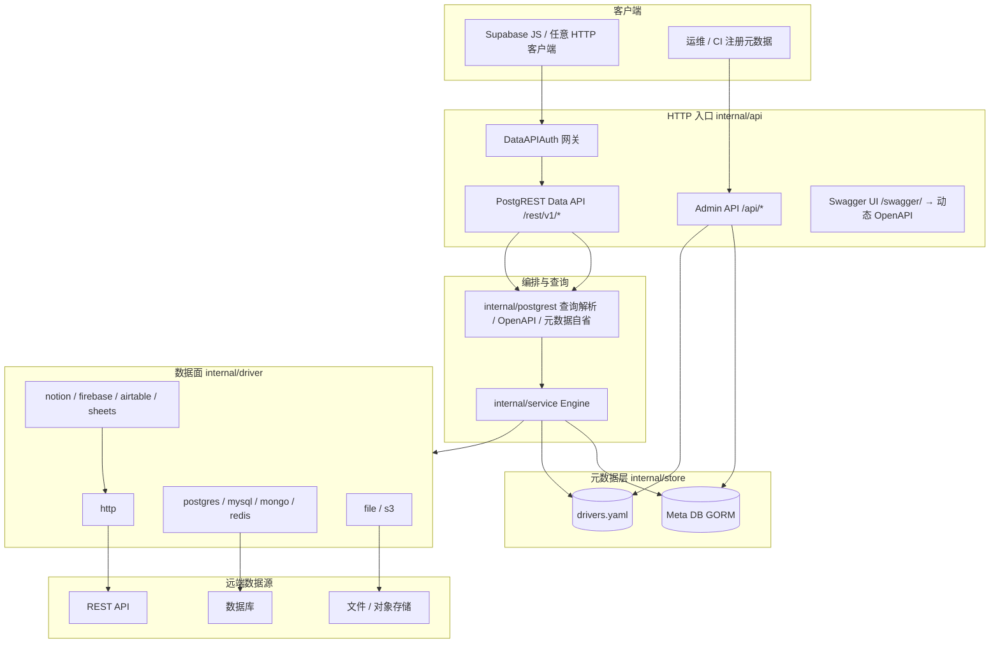
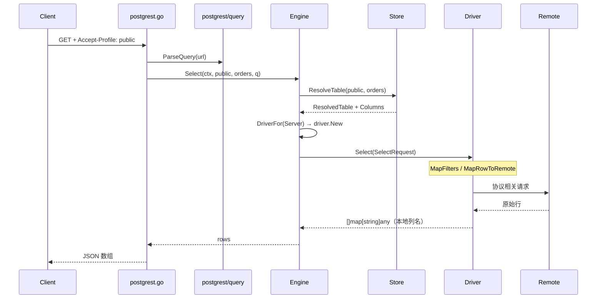

# dataspan 技术架构

dataspan 是一个 **PostgREST 风格的 HTTP Sidecar**：对外暴露统一的 REST 数据面，对内将请求转译为各协议 Driver 对远端数据源的查询。元数据采用类似 PostgreSQL **FDW（Foreign Data Wrapper）** 的 **Server → Foreign Table → Column / Function** 模型，但实现为独立进程，而非 PG 扩展。

- 入口协议：PostgREST 兼容的 JSON REST（`net/http`，无 gRPC）
- 编排核心：`Engine` 解析元数据并调度 Driver
- 元数据存储：PostgreSQL Meta DB 或声明式 `drivers.yaml`
- 当前 Data API 范围：**table、column、function**（含 schema 自省与 OpenAPI）；views、关系嵌入、RLS 等暂未支持

---

## 1. 整体架构



### 启动链路（`cmd/server`）

```
Vault(DATASPAN_VAULT_KEY)
  → store.NewFromEnv()          # db | file
  → service.NewEngine(store)
  → auth.NewGatewayFromEnv()    # 可选 Data API 鉴权
  → mux: Swagger UI + AdminHandler + PostgRESTHandler
  → CORS → Logging → DataAPIAuth → Listen :3020
```

Driver 通过 `cmd/server/main.go` 中的 blank import 注册到 `internal/driver/registry.go`。

---

## 2. 分层职责

| 层级 | 包 / 目录 | 职责 |
|------|-----------|------|
| 入口 | `cmd/server`, `cmd/migrate`, `cmd/cli` | 服务、迁移、CLI（`import` / `generate types`） |
| HTTP | `internal/api` | 路由、Admin CRUD、PostgREST 数据面、错误格式、CORS、日志 |
| 编排 | `internal/service` | `Engine`：Resolve 元数据 → 实例化 Driver → CRUD / RPC |
| 查询语义 | `internal/postgrest` | 过滤/排序/limit 解析、列名映射、PostgREST 错误码、OpenAPI 生成 |
| 元数据 | `internal/store` | `Store` 接口；postgres / file 双实现 |
| 协议适配 | `internal/driver` | 各远端协议的 Select/Insert/Update/Delete/Invoke |
| 模型 | `internal/models` | Server、Table、Column、Function 及请求 DTO |
| 凭证 | `internal/auth` | Vault 加解密、出站 HTTP 鉴权、可选网关 JWT |
| 导入 | `internal/importer` | OpenAPI / SQL / YAML → 声明式配置 |
| 迁移 | `internal/migrate` + `internal/models/entities.go` | Meta DB DDL（GORM AutoMigrate，仅 db 模式） |

---

## 3. 元数据模型（FDW 类比）

概念上与 PostgreSQL FDW 对应关系如下：

| FDW 概念 | dataspan 实体 | Postgres 表 / YAML 字段 |
|----------|---------------|-------------------------|
| Foreign Server | `Server` | `servers` / `servers[]` |
| 远端凭证 | `Credential` | `credentials` / `servers[].credential` |
| Foreign Table | `Table` | `foreign_tables` / `tables[]` |
| 列定义 | `Column` | `foreign_columns` / `tables[].columns` |
| 外部函数 / RPC | `Function` | `foreign_functions` / `functions[]` |

### 核心字段语义

- **schema_name**：逻辑命名空间，对应 PostgREST 的 `Accept-Profile` / `Content-Profile`（默认 `public`）
- **table_name / name**：API 侧本地名称
- **remote_name**：远端资源名（表名、集合、对象路径等）
- **Column.name → Column.remote_name**：API 使用本地列名；Driver 出站时映射为远端字段名

解析后的运行态结构：

- `ResolvedTable` = `Table` + `Server` + `[]Column`
- `ResolvedFunction` = `Function` + `Server`

---

## 4. 元数据存储双模式

由环境变量 `WRAPPER_STORE_MODE` 选择（`internal/store/config.go`）：

| 模式 | 配置来源 | 典型场景 |
|------|----------|----------|
| `db`（默认） | Meta DB DSN（`DATABASE_URL` / `DATABASE_DSN`）+ Admin API | 生产、动态注册 |
| `file` | `drivers.yaml`（`WRAPPER_DRIVERS_FILE`） | 本地开发、GitOps |

Legacy：`postgres` 作为 `db` 的别名仍可用。

DB 模式支持 **postgres / mysql / sqlite**，仅配置 DSN；表结构由 GORM model（`internal/models/entities.go`）驱动，`make migrate` 执行 AutoMigrate。

两种模式加载后 **内存模型一致**（`models.Server` / `Table` / `Column` / `Function`），对上层 `Engine` 透明。

```
db 模式注册流：
  POST /api/credentials → POST /api/servers → POST /api/tables → (可选) POST /api/functions

file 模式：
  编辑 drivers.yaml → make run（无需 migrate）
```

Meta DB 连接信息 **仅存在于 `.env` DSN**，不出现在 YAML 中。详见 [store.md](store.md)。

---

## 5. API 双平面

### 5.1 Admin API（管理面）

前缀 `/api/*`，JSON 错误格式：`{"error":"..."}`。

| 路径 | 说明 |
|------|------|
| `GET /health` | 健康检查（含 version） |
| 路径 | 方法 | 说明 |
|------|------|------|
| `/api/servers` | GET, POST | 列表 / 创建 |
| `/api/servers/{id}` | GET, PATCH, DELETE | Server CRUD |
| `/api/tables` | GET, POST | 列表 / 创建（含 columns） |
| `/api/tables/{id}` | GET, PATCH, DELETE | Table CRUD |
| `/api/tables/{id}/columns` | GET, POST | 列列表 / 新增列 |
| `/api/columns/{id}` | GET, PATCH, DELETE | Column CRUD |
| `/api/functions` | GET, POST | 列表 / 创建 |
| `/api/functions/{id}` | GET, PATCH, DELETE | Function CRUD |
| `/api/credentials` | POST | 创建加密凭证 |
| `/api/credentials/{id}` | DELETE | 删除凭证 |
| `POST /api/import` | POST | 导入 OpenAPI / SQL / YAML（db store） |

Admin **永不返回**凭证明文；写入时由 Vault（`DATASPAN_VAULT_KEY`）加密落库。

### 5.2 Data API（数据面，PostgREST 兼容）

前缀 `/rest/v1/` 与 `/v1/`，错误格式对齐 Supabase / PostgREST：

```json
{
  "code": "PGRST205",
  "message": "Could not find the table 'public.orders' in the schema cache",
  "details": null,
  "hint": null
}
```

#### 路径约定（`internal/api/postgrest_route.go`）

| 路径模式 | 说明 |
|----------|------|
| `/{table}` | 单段表名；schema 由 `Accept-Profile`（GET）或 `Content-Profile`（写操作）决定，默认 `public` |
| `/rpc/{function}` | RPC；schema 来自 `?schema=`、Profile 头或 `public` |

#### 表 CRUD

| 方法 | 行为 |
|------|------|
| `GET` | Select（`select`、`id=eq.1`、`order`、`limit`、`offset` 等） |
| `POST` | Insert（`Prefer: return=representation`） |
| `PATCH` | Update（带过滤条件） |
| `DELETE` | Delete（带过滤条件） |

#### RPC

`POST /rest/v1/rpc/{name}`，body 为 JSON 参数；`operation=invoke` 时走 Driver.Invoke，其余 operation 可绑定到逻辑表操作。

#### 元数据自省

**不在 Data API 暴露**。元数据直接从 Meta Store 读取，通过 **Admin API** 管理 / 查询：

| Admin 路径 | 对应模型 |
|------------|----------|
| `/api/servers` | `Server`（Foreign Server / 协议 + 连接） |
| `/api/tables` | `Table`（API 侧逻辑表） |
| `/api/tables/{id}/columns` | `Column` |
| `/api/functions` | `Function`（RPC） |

CLI `generate types` 通过 Admin API 拉取上述资源，生成 Supabase 风格 TypeScript 类型。

Data API 的 **OpenAPI**（`GET /rest/v1/`）仍从 Store 动态生成，描述已注册表的 CRUD/RPC，供 Swagger UI 使用。

#### OpenAPI（PostgREST Swagger 2.0）

从元数据动态生成，描述已注册的 table / column / function：

| 端点 | Content-Type |
|------|----------------|
| `GET /` | `application/openapi+json` |
| `GET /rest/v1/` | 同上 |
| `GET /v1/` | 同上 |

- `paths`：各表的 GET/POST/PATCH/DELETE 与 `/rpc/{fn}`
- `definitions`：行对象 schema（列类型、nullable、remote 映射说明）
- 非 `public` schema 可用 `Accept-Profile: {schema}` 过滤文档范围

实现：`internal/postgrest/openapi.go` → `BuildOpenAPI()`。

#### 可选网关鉴权

设置 `DATASPAN_ANON_KEY` 后，`/v1/` 与 `/rest/v1/` 要求 `apikey` + `Authorization: Bearer`（`internal/api/gateway_auth.go`）。未设置时本地开发开放访问。

### 5.3 API 文档 UI

| 路径 | 说明 |
|------|------|
| `/swagger/` | Swagger UI，加载运行时动态 OpenAPI（`GET /rest/v1/`） |

OpenAPI 仅从元数据 store **动态生成**（Swagger 2.0），无静态 spec 文件。

### 5.4 CLI（supabase-cli 风格）

单一入口 `cmd/cli` → `internal/cliapp`：

| 命令 | 说明 |
|------|------|
| `dataspan import` | OpenAPI / SQL / YAML → `drivers.yaml`（可选 `-apply` 写入 store） |
| `dataspan generate types` | 从 Admin API 拉取 meta，生成 Supabase 兼容 TypeScript `Database` 类型 |

```bash
make build-cli
./bin/dataspan import -input spec.yaml -output drivers.yaml
./bin/dataspan generate types typescript -o database.types.ts
```

实现：`internal/gentypes`（meta 客户端 + TS 生成）· `internal/cliapp/{app,import_cmd,generate,util}.go`。

---

## 6. 数据请求链路

以 `GET /rest/v1/orders?id=eq.1&select=id,amount` 为例：



元数据 OpenAPI 请求 **不进入 Engine / Driver**，由 `BuildOpenAPI` 直接读 Store。元数据 CRUD 走 Admin API。

---

## 7. Engine 与 Driver

### Engine（`internal/service/engine.go`）

```go
type Engine struct {
    Store store.Store
}
```

对每个数据操作：

1. `Store.ResolveTable` / `ResolveFunction`
2. `Store.ServerCredential` 解密凭证
3. `driver.New(ctx, server, cred)` 按 `protocol` 选择实现
4. 调用 `Driver.Select | Insert | Update | Delete | Upsert | Invoke`

Function 的 `operation` 为 `select|insert|update|upsert|delete` 时，可通过 `options.tableSchema` + `options.tableName` 代理到表 CRUD。

### Driver 接口（`internal/driver/driver.go`）

```go
type Driver interface {
    Select(ctx, SelectRequest) ([]map[string]any, error)
    Insert(ctx, RowRequest) (map[string]any, error)
    Update(ctx, RowRequest) (int, error)
    Upsert(ctx, RowRequest) (bool, map[string]any, error)
    Delete(ctx, DeleteRequest) (int, error)
    Invoke(ctx, InvokeRequest) (any, error)
}
```

新协议扩展步骤：

1. 在 `internal/driver/{proto}/` 实现 `Driver`
2. `init()` 中 `driver.Register(protocol, factory)`
3. `cmd/server/main.go` blank import
4. 在 `models.Protocol` 增加协议常量

### Driver 分组

```
HTTP 通用层     http          — 任意 REST / PostgREST 上游
HTTP 预设       notion, firebase, airtable, sheets  — 委托 httpwrap → http
原生协议        postgres, mysql, mongo, redis
文件 / 对象     file, s3
```

详见 [drivers.md](drivers.md)。

---

## 8. 查询转译（`internal/postgrest`）

| 模块 | 功能 |
|------|------|
| `query.go` | 解析 `id=eq.1`、`select`、`order`、`limit`、`offset`、`Prefer` |
| `query.go` | `MapFilters` / `MapRowToRemote` / `MapRowsFromRemote` 列名双向映射 |
| `errors.go` | `PGRST*` 错误码，兼容 Supabase 客户端 |
| `openapi.go` | 元数据 → Swagger 2.0 |

**约定**：过滤条件与 PATCH body 均使用 **本地列名**；Driver 出站前映射为 `remote_name`。

---

## 9. 安全与凭证

| 密钥 / 配置 | 位置 | 用途 |
|-------------|------|------|
| `DATASPAN_VAULT_KEY` | `.env` | 32 字节 base64，加密 Foreign Credential |
| `DATABASE_URL` / `DATABASE_DSN` | `.env` | Meta DB 连接（仅 db 模式） |
| `servers[].credential` | YAML 或 Admin API | 远端数据源密钥；支持 `${ENV_VAR}` |
| `DATASPAN_ANON_KEY` 等 | `.env` | 可选 Data API 网关 |

出站 HTTP 鉴权类型（`internal/auth/httpauth.go`）：`NONE`、`BASIC`、`API_KEY`、`BEARER_TOKEN`、`CLIENT_CREDENTIALS`、`UNIVERSAL`。

---

## 10. 仓库目录结构

```
dataspan/
├── cmd/
│   ├── server/          # HTTP 服务主入口
│   ├── migrate/         # Meta DB 迁移 CLI
│   └── cli/             # 统一 CLI（import、generate types）
├── internal/
│   ├── api/             # HTTP handlers（admin, postgrest, swagger UI）
│   ├── auth/            # Vault、网关、出站鉴权
│   ├── cliapp/          # CLI 子命令实现
│   ├── gentypes/        # meta 拉取 + TypeScript 类型生成
│   ├── driver/          # 协议 Driver 实现 + registry
│   ├── importer/        # 声明式配置导入
│   ├── models/          # 领域模型
│   ├── postgrest/       # 查询语义、错误、OpenAPI、元数据自省
│   ├── service/         # Engine
│   └── store/
│       ├── db/            # Meta DB 实现（GORM）
│       └── file/          # drivers.yaml 实现
├── internal/models/entities.go  # Meta DB GORM 模型
├── docs/                # 架构与模块文档
├── deploy/              # Dockerfile、docker-compose
├── drivers.yaml.example # file 模式示例配置
└── e2e/                 # 端到端用例
```

---

## 11. 能力边界（当前版本）

**已支持**

- Foreign Server / Table / Column / Function 元数据注册与解析
- PostgREST 风格 CRUD + RPC
- 多 schema（Profile 头）
- 列本地名 ↔ 远端名映射
- Data API OpenAPI 自省
- CLI `generate types` 从 Admin API 生成 Supabase 风格 TS 类型
- postgres + file 双 store 模式（db 模式支持 pg/mysql/sqlite DSN）
- 多协议 Driver（见 `models.Protocol`）

**暂未支持**

- Views、物化视图
- 表间关系 / 嵌套资源 / 深度路由
- PostgreSQL RLS 语义（网关仅有 key/JWT，无行级权限）
- PostgREST 全部高级特性（如 `Prefer: count=exact`、全文检索操作符等，按实现逐步补齐）

---

## 12. 相关文档

| 文档 | 内容 |
|------|------|
| [architecture.md](architecture.md) | 英文简版架构摘要 |
| [store.md](store.md) | 元数据存储模式详解 |
| [drivers.md](drivers.md) | Driver 选型与扩展 |
| [modules.md](modules.md) | `internal/*` 模块索引 |
| [.cursor/DEVELOPMENT.md](../.cursor/DEVELOPMENT.md) | 本地 env、make、curl 示例 |
| [deploy/README.md](../deploy/README.md) | 生产部署 |
